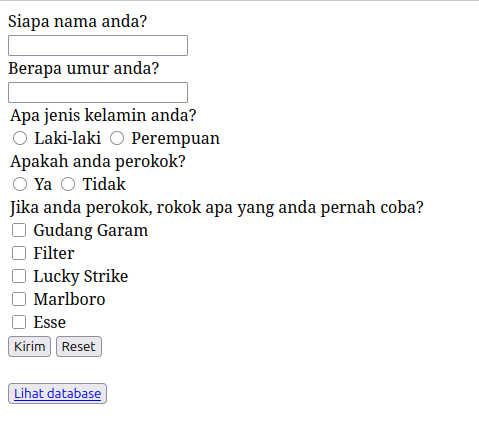

# Form Survey

Minitask membuat form survey yang element htmlnya dibuat melalui Javascript

## Ketentuan dalam pembuatan form survey:
1. Membuat form survey dengan struktur yang sama seperti yang sebelumnya dibuat
2. Elemen langsung ditambahkan ke dalam body html melalui javascript
3. Tanpa inner html

Gambar form:
